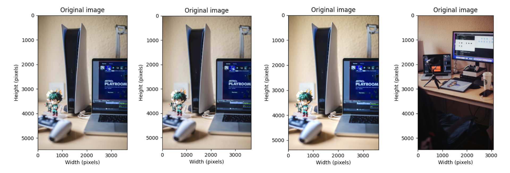
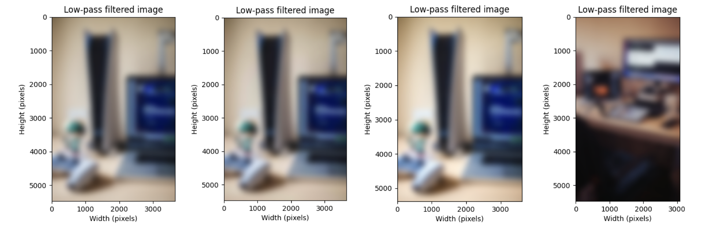
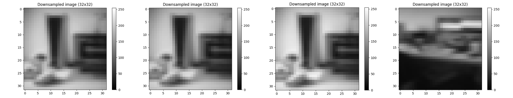
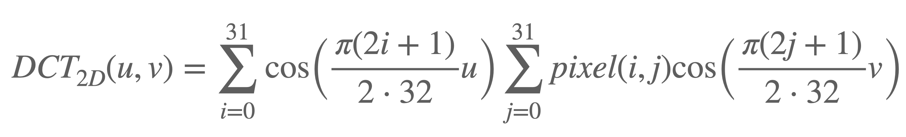
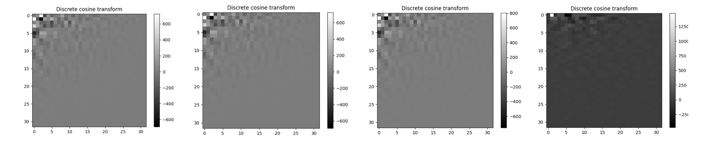
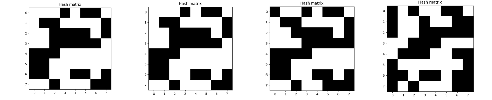

# SwiftPerceptualHash

Swift package to create a *Perceptual Image Hash* from a source image. Perceptual Image Hashes output similar hashes for similar images, which allows for easy duplicate image detection that is robust to different compression algorithms or image sizes.

## How to use

```swift
// Create manager only once, reuse throughout the app
let hashManager = PerceptualHashManager()

// There are many ways to get a Data type representing an image. For example:
let imageData = UIImage(named: "SampleImage".png)!.pngData()

// Once you have a reference to the Data of an image, creating the hash is easy and fast:
let hash = hashManager.perceptualHash(imageData: imageData)

// You can get different String representations from the hash. For example:
print(hash.hexString) // 2879bv9r58qsv
```

## Project structure

All the fun bits are in `Sources/SwiftPerceptualHash/PerceptualHashManager.swift`.

## Algorithm overview

### Original images
At the beginning, the image is imported to a `MTLTexture` at its full size. Here you can see four different images, which are (from left to right):
- An example image.
- The previous image, saved with the maximum JPG compression (size went from 11.2MB to 501KB).
- The first image, slightly cropped and with a slight exposure and saturation boost.
- Another example image.



### Low-pass filter
To avoid aliasing issues when the image is downsampled, a gaussian kernel (acting as a low-pass filter) removes all the high-frequency information from the image that could cause aliasing issues when downsampling the image. The σ of the gaussian kernel is computed as `σ = 1 / ( 2 * maxScaleFactor )`, where `minScaleFactor` is the scale factor required to transform the full size image to the 32x32 size used in the next step (downsampling). If the image is not square, we conservatively apply the blur with the minimum radius (the one with the minimum scale factor).



### Downsampling
The image is then downsampled in the GPU using a bilinear filter to a 32x32 pixels texture and the color information is removed. Grayscale conversion uses a Rec. 709 Luma coefficient for no particular reason (we had to pick a grayscale conversion, it doesn't matter much which one).


### Discrete Cosine Transform (DCT)
A Discrete Cosine Transform (DCT) is then applied to the 32x32 image. You're probably better off trying to understand how a DCT works anywhere else than me explaining it here. Key things to know is that upper-left corner contains the low-frequency information and the bottom-right corner contains the high-frequency information. The "perceptual" part of the image hashing is based on the low-frequency part, so despite the DCT using the full 32x32 texture to compute the coefficients, only the upper 8x8 coefficients of the DCT matrix are computed.
The basic formula is:



Where `u`, `v` make a 8x8 image (range: `[0 to 8)`).



### Hash
To compute the hash from the 8x8 DCT, the `[0,0]` value is set to `0.0`, essentially removing any constant component throughout the image. Then, the mean of the 8x8 matrix is computed. The, for each value in the matrix, a "1" is written if the DCT of that position was greater than the mean, and a "0" is written otherwise.


Similar images have similar hashes. The first sample image and its heavily compressed version share the same hash, but the slightly cropped + color adjusted image has a slightly different hash. The last image, which is completely different, has a completely different hash.
